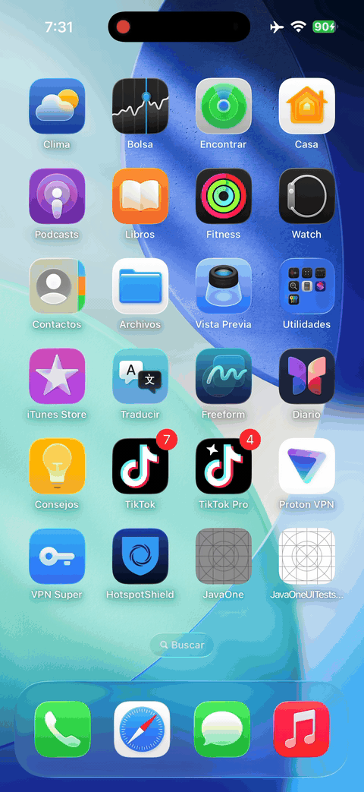
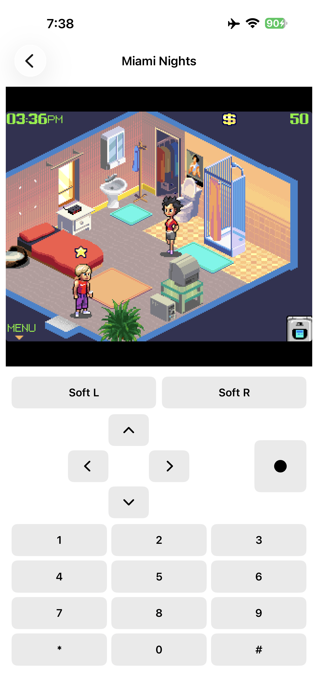
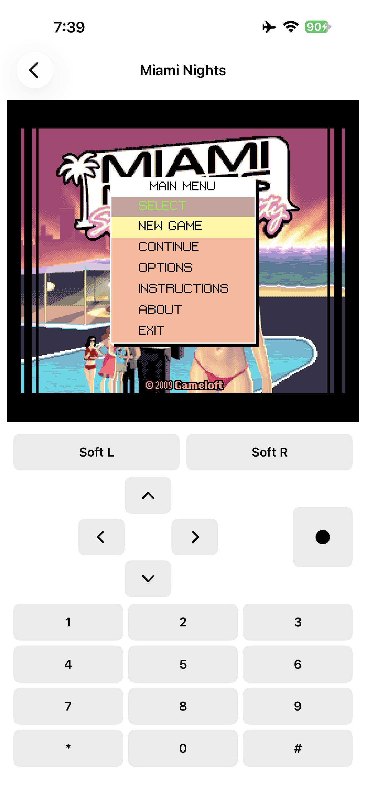
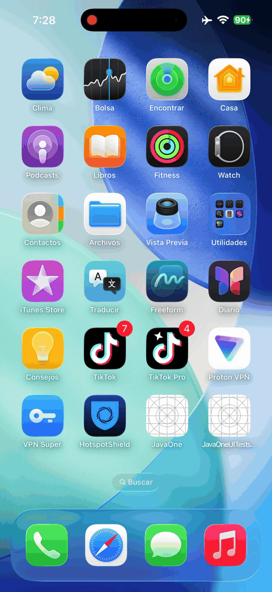
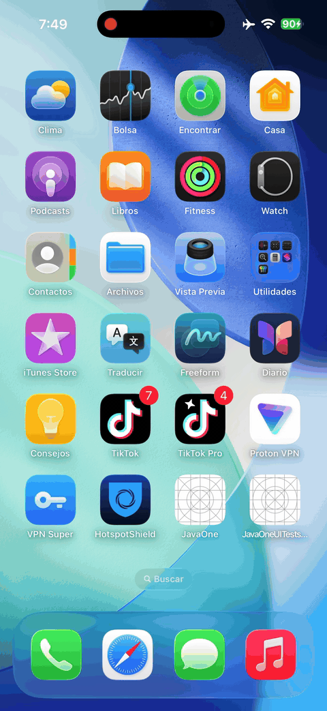
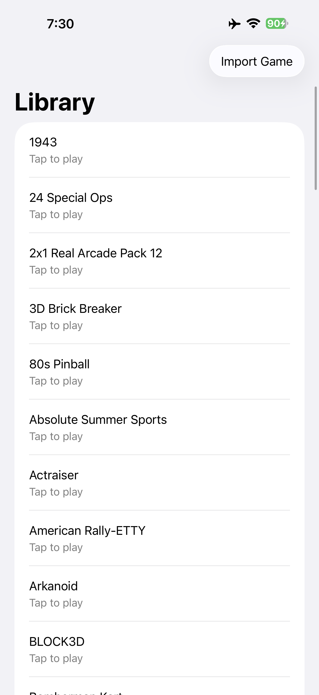
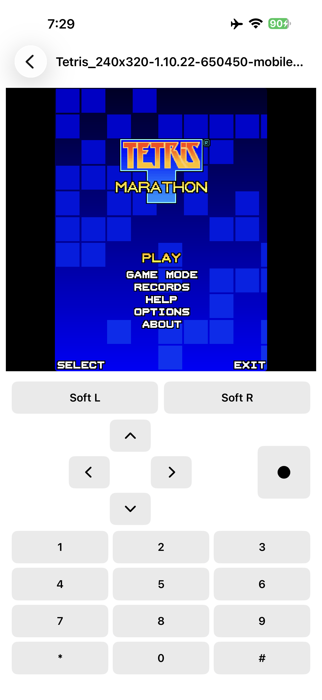
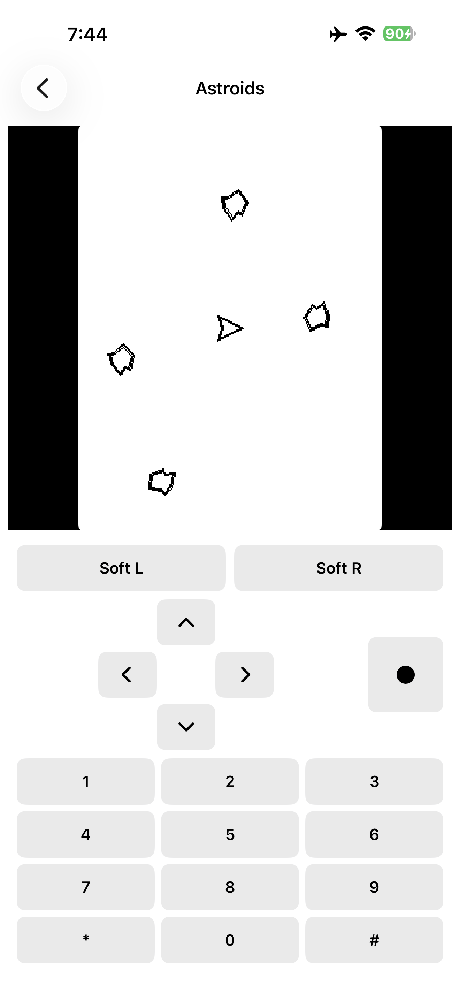
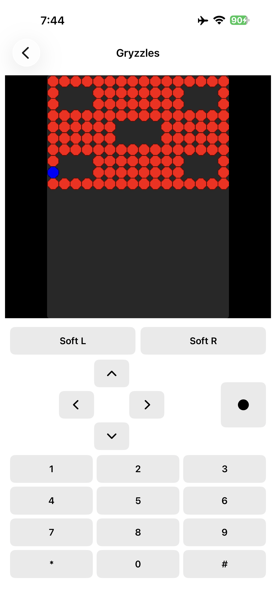

# JavaOne

**Run classic Java ME (J2ME) games natively on iPhone and iPad.**

Embedded OpenJDK Mobile · FreeJ2ME · SwiftUI · Open Source

<p align="center">
  
</p>

<p align="center">
  <em>Miami Nights: Singles in the City — gameplay on a physical iPhone</em>
</p>

<p align="center">
  <a href="https://flakito-loko.github.io/JavaOne/"></a>
  <a href="https://github.com/flakito-loko/JavaOne/releases"></a>
  <a href="https://github.com/flakito-loko/JavaOne"></a>
  <a href="https://github.com/flakito-loko/JavaOne/actions/workflows/docs.yml"></a>
</p>

<p align="center">
  
  
  
  
  <a href="https://flakito-loko.github.io/JavaOne/"></a>
</p>

<p align="center">
  <a href="https://flakito-loko.github.io/JavaOne/">Documentation</a> ·
  <a href="https://flakito-loko.github.io/JavaOne/compatibility/">Compatibility</a> ·
  <a href="https://flakito-loko.github.io/JavaOne/architecture/">Architecture</a> ·
  <a href="https://flakito-loko.github.io/JavaOne/roadmap/">Roadmap</a> ·
  <a href="https://github.com/flakito-loko/JavaOne">Source</a>
</p>

---

## Current Status

| Feature | Status |
|---------|--------|
| Embedded OpenJDK Mobile | ✅ |
| FreeJ2ME Runtime | ✅ |
| Commercial MIDlets | ✅ |
| LCD Rendering | ✅ |
| Touch Input | ✅ |
| Virtual Keypad | ✅ |
| Save / Load (RMS) | ✅ |
| Multiple Launch Cycles | ✅ |
| Gameplay | ✅ |
| Silent Audio Compatibility | ✅ |
| Native Audio Playback | 🚧 In Progress |
| Compatibility Expansion | 🚧 In Progress |

---

## Reference Game

### Miami Nights: Singles in the City

Validated on:

- Physical iPhone
- Embedded OpenJDK Mobile
- FreeJ2ME
- SwiftUI frontend

**Current validation**

| Check | Result |
|-------|--------|
| Launch | ✓ |
| Menus | ✓ |
| Gameplay | ✓ |
| Save | ✓ |
| Load | ✓ |
| Dialogs | ✓ |
| Stable gameplay | ✓ |
| No crashes during manual play session | ✓ |

**Remaining work**

- Native MMAPI audio backend
- Compatibility expansion

<p align="center">
  
  &nbsp;
  
</p>

<p align="center">
  <em>Gameplay and menu — Miami Nights on device</em>
</p>

---

## Showcase

| Preview | Caption |
|:-------:|---------|
|  | **Miami Nights** — commercial title, playable session on physical iPhone |
|  | **Tetris** — LCD rendering and virtual keypad |
|  | **Astroids** — touch + keypad input path |

| Screenshot | Caption |
|:----------:|---------|
|  | **Library** — SwiftUI game list and import |
|  | **Tetris** — FreeJ2ME LCD surface |
|  | **Astroids** — device capture |
|  | **Gryzzles** — RMS / save path validation |

More captures: [Screenshots](https://flakito-loko.github.io/JavaOne/screenshots/)

---

## Gameplay Videos

Full device recordings (MP4):

| Title | Video |
|-------|-------|
| Miami Nights | [miami-nights.MP4](docs/assets/videos/miami-nights.MP4) |
| Tetris | [tetris.mp4](docs/assets/videos/tetris.mp4) |
| Astroids | [astroids.MP4](docs/assets/videos/astroids.MP4) |

HTML5 playback is available on the [documentation site](https://flakito-loko.github.io/JavaOne/).

---

## Architecture

```text
SwiftUI
  ↓
Bridge
  ↓
Runtime Host
  ↓
Embedded OpenJDK Mobile
  ↓
FreeJ2ME
  ↓
Commercial MIDlet
```

Details: [Architecture](https://flakito-loko.github.io/JavaOne/architecture/)

---

## Roadmap

### Completed Milestones

- Embedded JVM (OpenJDK Mobile Zero)
- FreeJ2ME Integration
- AWT
- ImageIO
- JPEG
- FontManager
- RMS
- Commercial MIDlets
- Miami Nights gameplay

### Current Work

- Native MMAPI Audio
- Compatibility Database

### Future Work

- Controller support
- Per-game settings
- Save States
- Performance optimization
- Shader pipeline

Full plan: [Roadmap](https://flakito-loko.github.io/JavaOne/roadmap/)

---

## Documentation

| Guide | Description |
|-------|-------------|
| [Getting Started](https://flakito-loko.github.io/JavaOne/getting-started/) | Install and launch a MIDlet |
| [Why JavaOne?](https://flakito-loko.github.io/JavaOne/why-javaone/) | Vision and technical rationale |
| [Architecture](https://flakito-loko.github.io/JavaOne/architecture/) | Layer ownership |
| [Compatibility](https://flakito-loko.github.io/JavaOne/compatibility/) | Device-validated matrix |
| [Roadmap](https://flakito-loko.github.io/JavaOne/roadmap/) | Milestones and next steps |
| [FAQ](https://flakito-loko.github.io/JavaOne/faq/) | Common questions |

```bash
python3 -m venv .venv-docs && source .venv-docs/bin/activate
pip install -r requirements-docs.txt
mkdocs serve
```

---

## Brand

Official assets: [`assets/branding/`](assets/branding/) · [Guidelines](assets/branding/branding-guidelines.md)

Palette: `#2563EB` · `#60A5FA` · `#0B1220` · `#FFFFFF` · `#94A3B8`

---

## Status

🚧 **Alpha · v0.9.0-alpha** — commercial J2ME titles run on physical iPhone with embedded OpenJDK Mobile. Native audio playback and broader compatibility are in progress.

---

## Contributing

See [CONTRIBUTING.md](CONTRIBUTING.md), [CODE_OF_CONDUCT.md](CODE_OF_CONDUCT.md), and [SECURITY.md](SECURITY.md).

---

## License

Application licensing: see repository terms when published.  
Vendor FreeJ2ME: **GPL-3.0** (`Vendor/FreeJ2ME`).  
Brand assets: original JavaOne identity (see branding guidelines).

---

<p align="center">
  <a href="https://github.com/flakito-loko/JavaOne">GitHub</a> ·
  <a href="https://flakito-loko.github.io/JavaOne/">Documentation</a> ·
  <a href="https://flakito-loko.github.io/JavaOne/roadmap/">Roadmap</a> ·
  <a href="https://flakito-loko.github.io/JavaOne/compatibility/">Compatibility</a>
</p>

<p align="center">Copyright © JavaOne contributors</p>
