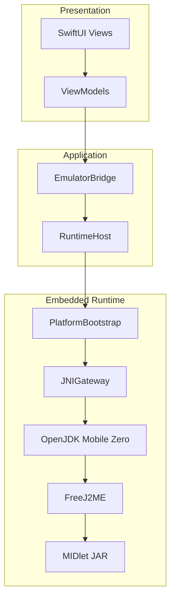
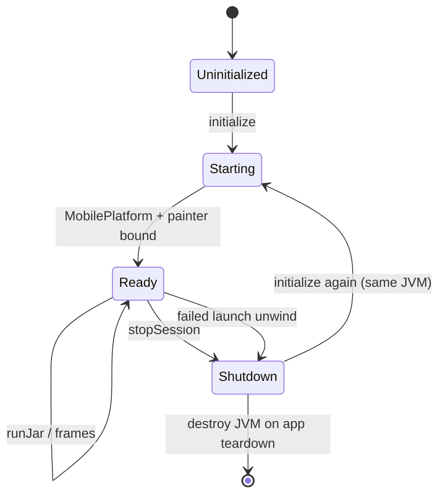

# Architecture

JavaOne keeps SwiftUI and product features isolated from FreeJ2ME. All launches go through a bridge layer so the upstream emulator can evolve with minimal forks.

## Layer stack

```text
SwiftUI
  ↓
Bridge
  ↓
RuntimeHost
  ↓
PlatformBootstrap
  ↓
JNIGateway
  ↓
Embedded OpenJDK Mobile
  ↓
FreeJ2ME
  ↓
MIDlet
```



## Responsibilities

| Layer | Responsibility |
|-------|----------------|
| **SwiftUI** | Library, emulator chrome, keypad/touch UI. No business logic beyond presentation. |
| **Bridge** | Single entry point for launch/stop session APIs used by ViewModels. |
| **RuntimeHost** | Owns runtime lifecycle; maps product models to bootstrap operations. |
| **PlatformBootstrap** | Ordered bring-up: JVM ready → MobilePlatform → dataPath → loadJar → runJar → painter/LCD. |
| **JNIGateway** | Sole component authorized to invoke JNI. Thread-attach and exception discipline. |
| **Embedded OpenJDK Mobile** | In-process Zero JVM suitable for iOS constraints. |
| **FreeJ2ME** | Java ME / MIDP implementation (vendor tree). |
| **MIDlet** | Untrusted game code running inside the embedded runtime. |

## Design rules

From [`AGENTS.md`](https://github.com/javaonelabs/JavaOne/blob/main/AGENTS.md):

- Views ↔ ViewModels only
- ViewModels never access SwiftData directly
- Repositories are the persistence boundary
- Prefer protocols and composition
- Change FreeJ2ME as little as possible

## Related deep dives

- [Technical Reports](technical-reports.md)
- `docs/Architecture/` — embedded JVM ADRs and epic reports
- `docs/EMULATOR_ARCHITECTURE.md` — bridge-oriented overview
- `docs/FREEJ2ME_RUNTIME_CONTRACT.md` — host/runtime contract

## Session lifecycle (simplified)



Epic 11 hardened recovery so a failed launch cannot leave the host stuck in `ready` without teardown.
