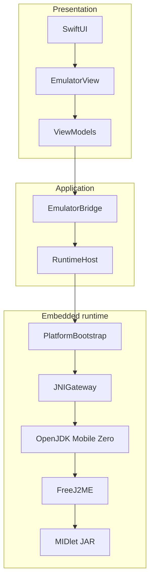
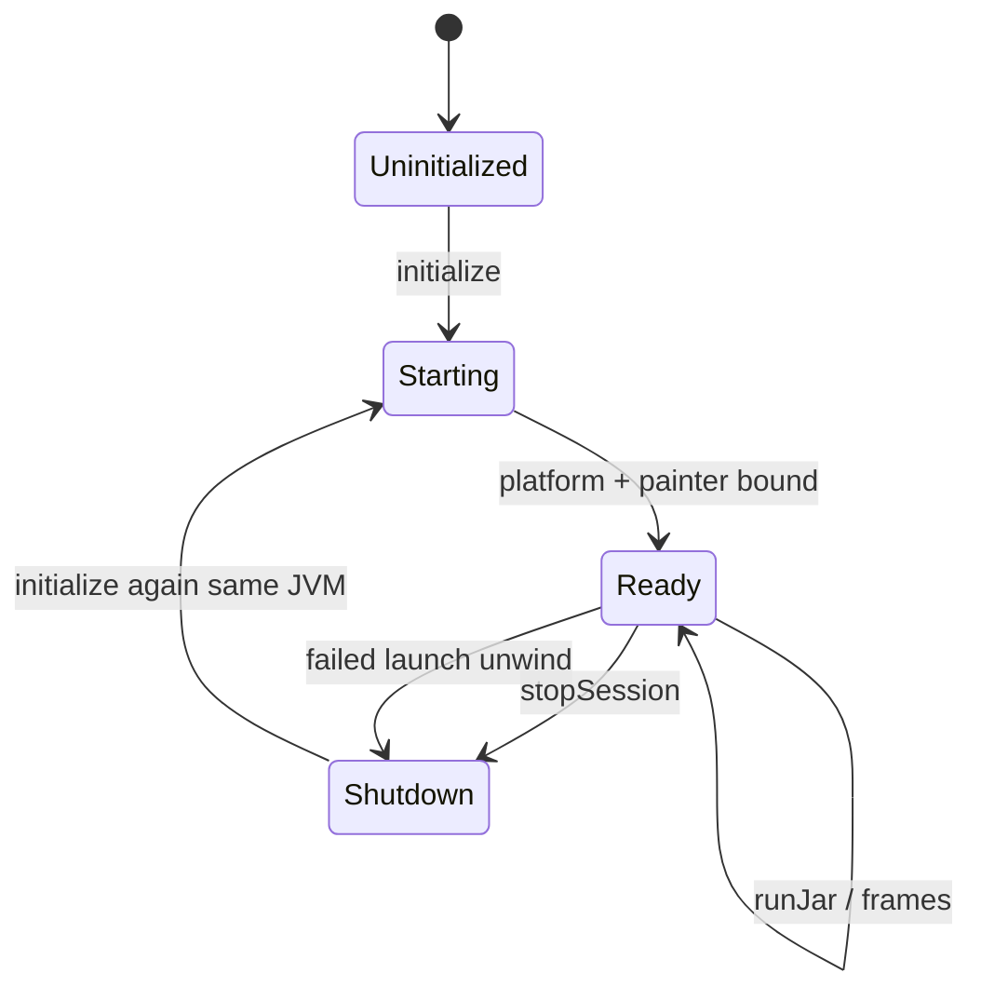

# Architecture

JavaOne isolates SwiftUI from FreeJ2ME. All launches cross a bridge so the vendor emulator can evolve with minimal forks.

## Layer stack

```text
SwiftUI
  ↓
EmulatorView
  ↓
Bridge
  ↓
RuntimeHost
  ↓
PlatformBootstrap
  ↓
JNIGateway
  ↓
Embedded OpenJDK Mobile
  ↓
FreeJ2ME
  ↓
MIDlet
```



## Ownership and responsibilities

| Layer | Owns | Must not |
|-------|------|----------|
| **SwiftUI / EmulatorView** | Layout, chrome, keypad/touch gestures | Call JNI or FreeJ2ME types |
| **ViewModels** | Session UX state | Touch SwiftData or JNI |
| **Bridge** | Launch/stop API for the app | Embed FreeJ2ME classes |
| **RuntimeHost** | Map product models → bootstrap ops | Leak `JNIEnv` upward |
| **PlatformBootstrap** | Ordered bring-up (JVM → MobilePlatform → dataPath → loadJar → runJar → painter) | Become a UI controller |
| **JNIGateway** | Sole JNI invoke path, attach, exceptions | Create/destroy the JVM casually |
| **OpenJDK Mobile** | In-process Zero VM | Be replaced by a desktop process on iOS |
| **FreeJ2ME** | MIDP/CLDC + LCD | Be patched except when a story requires a minimal fix |
| **MIDlet** | Game code | Escape the sandbox |

## Session lifecycle



Epic 11 ensured failed launches always unwind via `stopSession`, so the host cannot stick in `ready`.

## Related docs

- [Why JavaOne?](why-javaone.md)
- [Milestones](milestones.md)
- [Technical Reports](technical-reports.md)
- `docs/Architecture/` — embedded JVM ADRs
