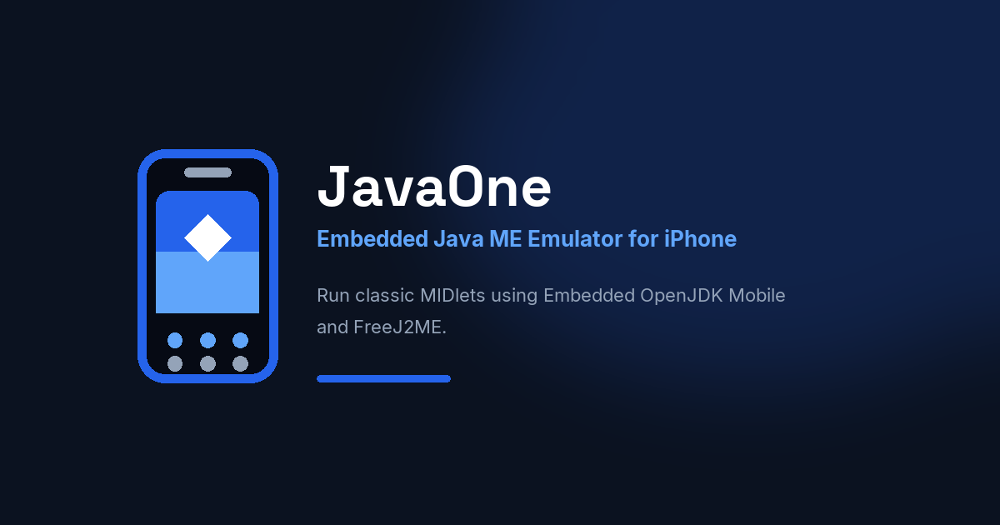

# Branding

JavaOne visual identity — original mark (phone + LCD + diamond core + keypad). Not affiliated with Oracle Java branding.

## Assets

Canonical files: [`assets/branding/`](https://github.com/flakito-loko/JavaOne/tree/main/assets/branding)

| Asset | Preview |
|-------|---------|
| Isotype | { width="64" } |
| Logo (dark) | { width="280" } |
| Logo (light) | { width="280" } |
| Banner |  |
| Social |  |
| App icon | { width="128" } |

## Guidelines

Full rules: [`branding-guidelines.md`](https://github.com/flakito-loko/JavaOne/blob/main/assets/branding/branding-guidelines.md)

### Palette

| Token | Swatch | Hex |
|-------|--------|-----|
| Primary |  | `#2563EB` |
| Secondary |  | `#60A5FA` |
| Background |  | `#0B1220` |
| White |  | `#FFFFFF` |
| Gray |  | `#94A3B8` |

### Typography

- **Space Grotesk** — titles
- **Inter** — body
