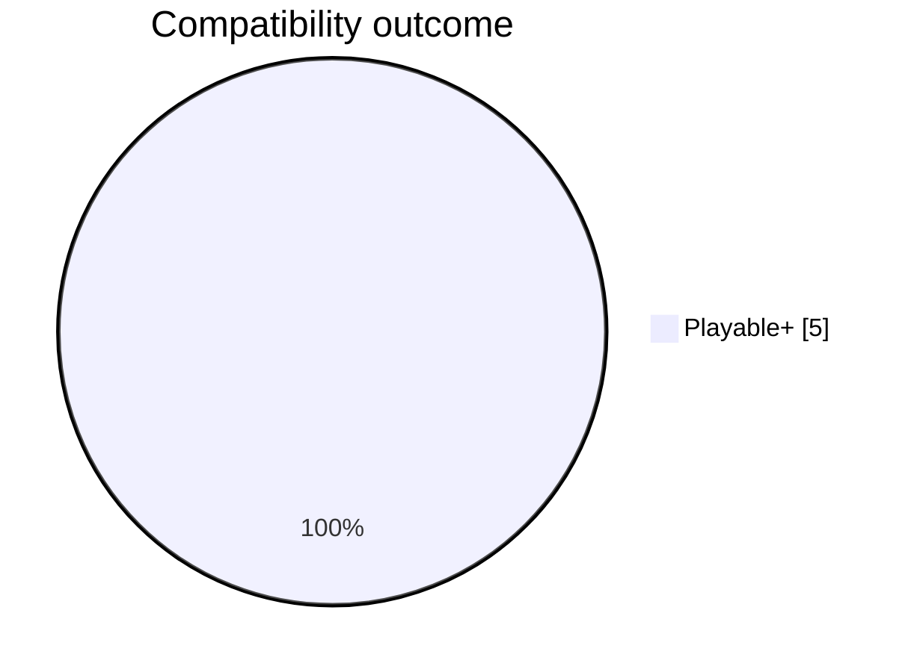
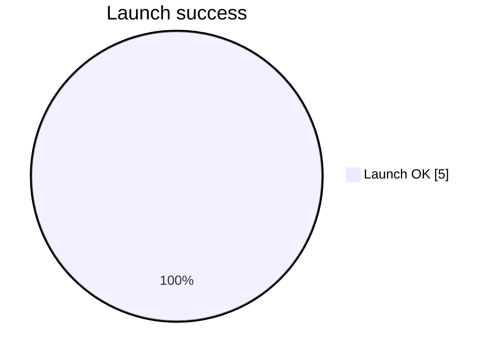
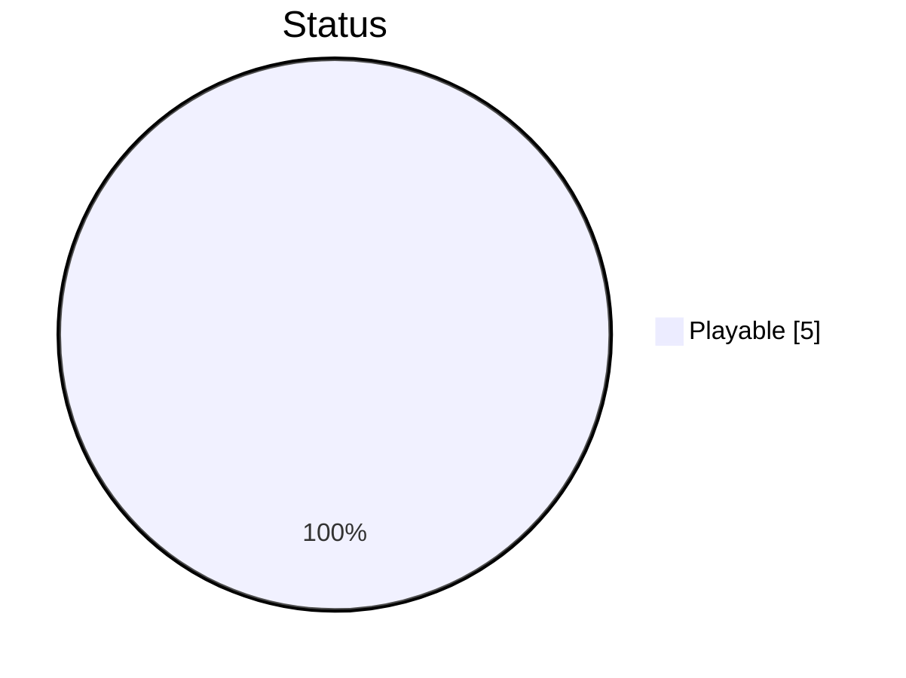
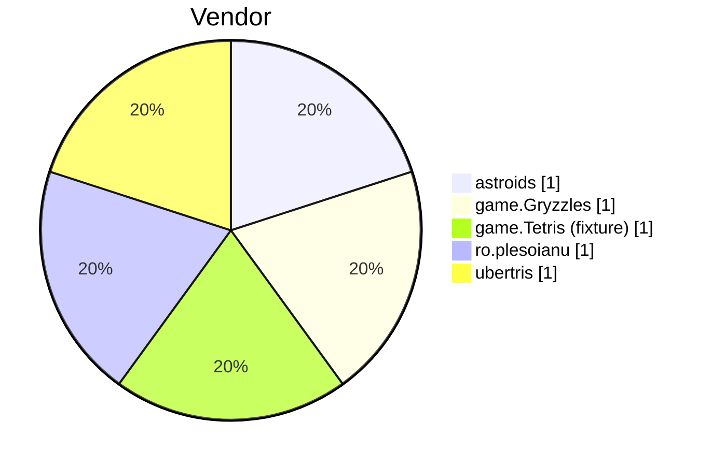
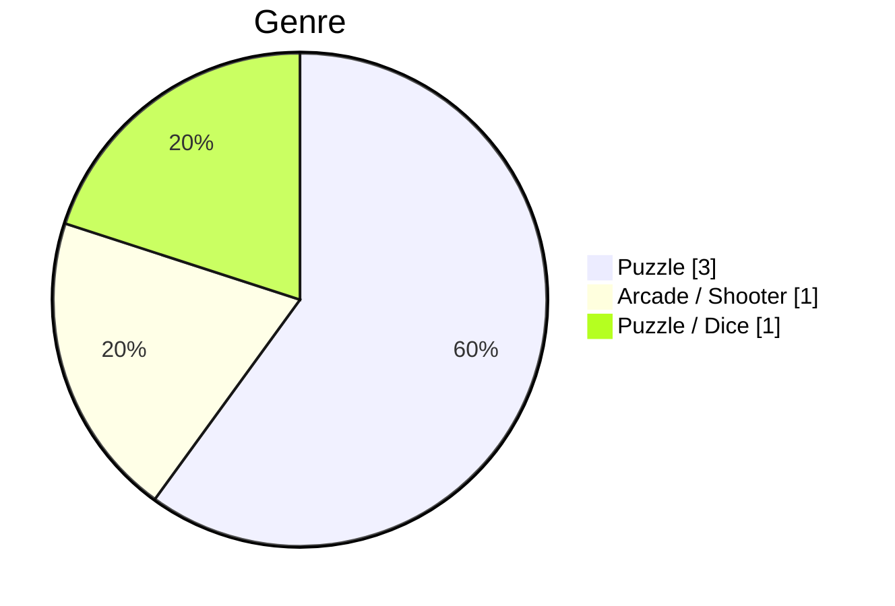
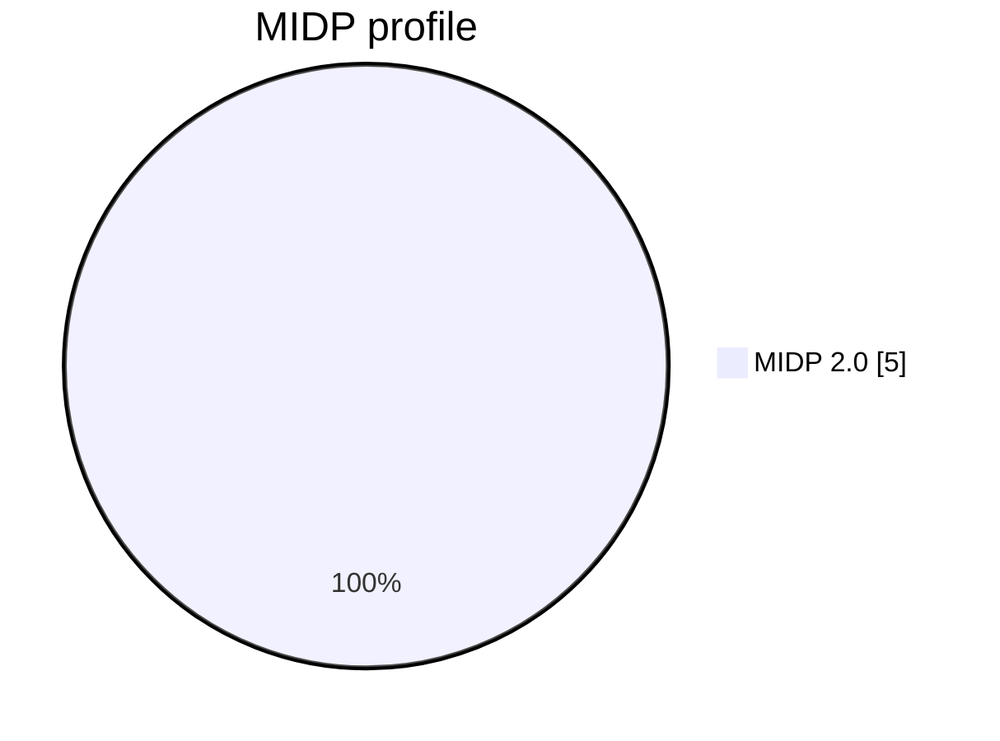

# Compatibility Statistics

Auto-generated from `compatibility/compatibility.json`. Re-run `scripts/docs/sync_compatibility.py` after editing the JSON.

## Headline rates

| Metric | Count | Rate |
|--------|------:|-----:|
| Titles | 5 | 100% |
| Launch success | 5 | 100.0% |
| Playable+ | 5 | 100.0% |
| Partial | 0 | 0.0% |
| Launch only | 0 | 0.0% |
| Not working | 0 | 0.0% |

## Launch success

## Status distribution

## Vendor comparison

## Genre comparison

## MIDP comparison

## Notes

Charts reflect the **current published corpus only**. Expanding Epic 12+ titles will change these rates automatically when `compatibility.json` is updated.
