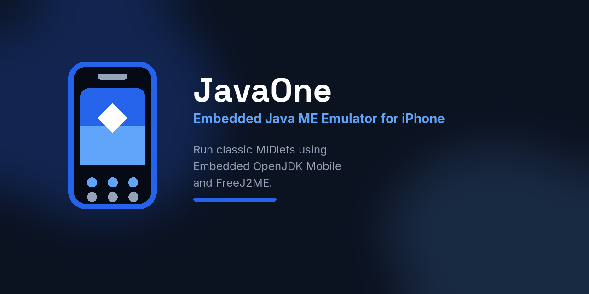
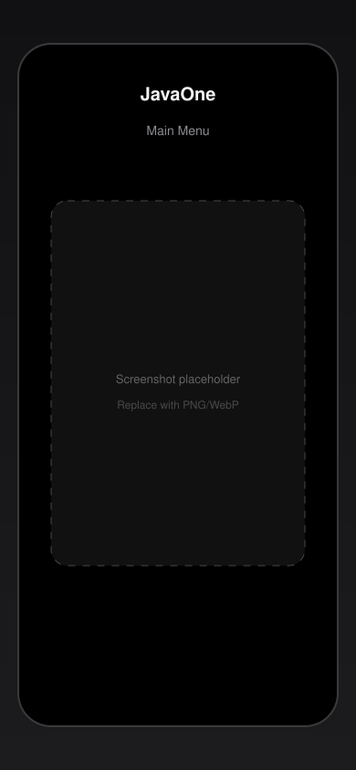
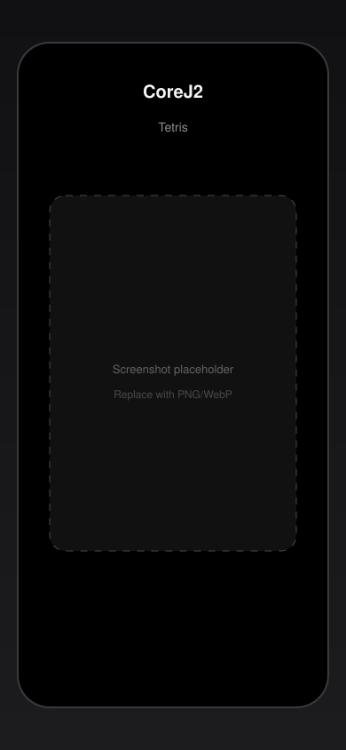
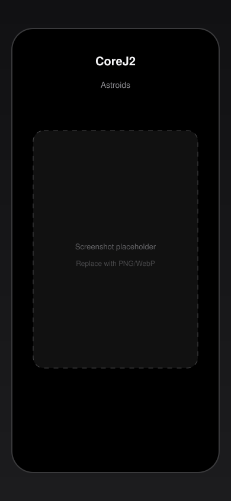
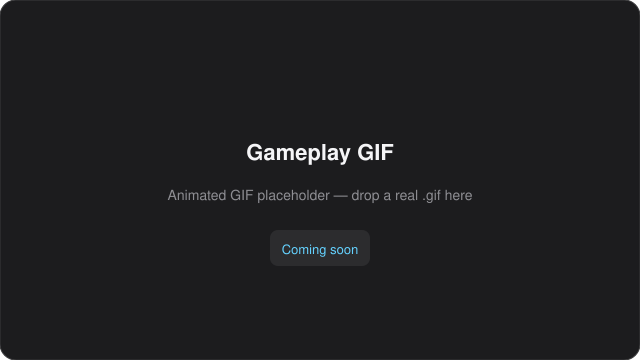
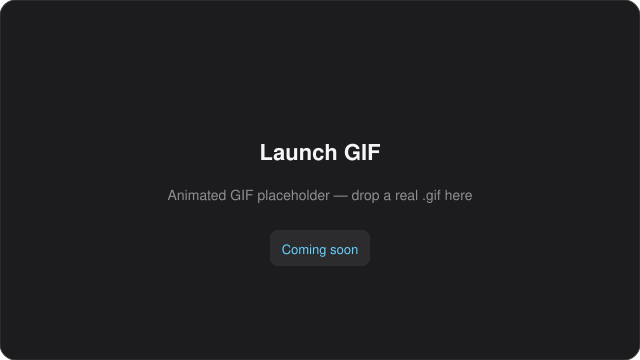
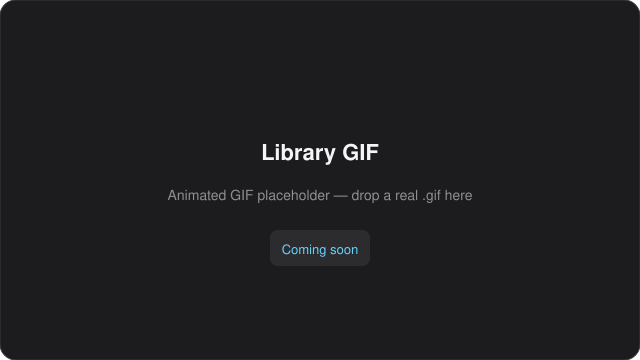
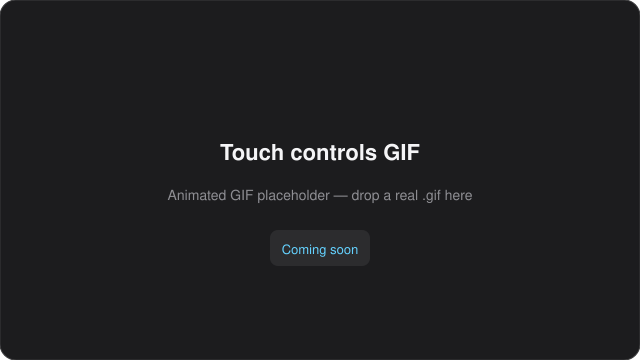
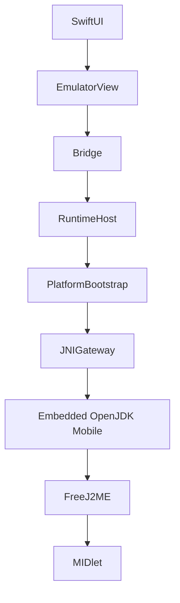

---
hide:
  - navigation
  - toc
---

{ width="96" }

# JavaOne

Embedded Java ME Emulator for iPhone

Run classic J2ME games natively on iOS using an embedded OpenJDK Mobile runtime and FreeJ2ME.

[📖 Documentation](getting-started.md){ .md-button .md-button--primary }
[🎮 Compatibility](compatibility.md){ .md-button }
[🏗 Architecture](architecture.md){ .md-button }
[🗺 Roadmap](roadmap.md){ .md-button }
[📥 Source Code](https://github.com/flakito-loko/JavaOne){ .md-button }

---

## Features

-   :material-chip: **Embedded OpenJDK Mobile**
-   :material-language-java: **FreeJ2ME runtime**
-   :material-apple: **Native SwiftUI frontend**
-   :material-monitor: **LCD rendering**
-   :material-gesture-tap: **Touch**
-   :material-keyboard: **Virtual keypad**
-   :material-memory: **Persistent JVM**
-   :material-content-save: **RMS support**
-   :material-gamepad-variant: **Commercial MIDlets**

---

## Screenshots

More placeholders: [Alea](images/screenshots/alea.svg) · [Gryzzles](images/screenshots/gryzzles.svg) · [Settings](images/screenshots/settings.svg)  
See [Screenshots](screenshots/index.md).

---

## Animated captures

Placeholders only — replace with real `.gif` files when available.

| Gameplay | Launch | Library | Touch controls |
|:--------:|:------:|:-------:|:--------------:|
|  |  |  |  |

---

## Runtime stack

---

## Explore

| Page | Why |
|------|-----|
| [Why JavaOne?](why-javaone.md) | Vision and technical rationale |
| [Getting Started](getting-started.md) | First launch |
| [Compatibility](compatibility.md) | Device-validated matrix |
| [Milestones](milestones.md) | How we got here |
| [Architecture](architecture.md) | Ownership by layer |
| [Roadmap](roadmap.md) | Epics and progress |
| [Performance](performance.md) | Benchmark placeholders |
| [FAQ](faq.md) | Common questions |
| [Branding](branding.md) | Visual identity |

---

🚧 **Alpha** · [GitHub](https://github.com/flakito-loko/JavaOne) · [Roadmap](roadmap.md) · [Compatibility](compatibility.md) · [License / Security](https://github.com/flakito-loko/JavaOne/blob/main/SECURITY.md)

