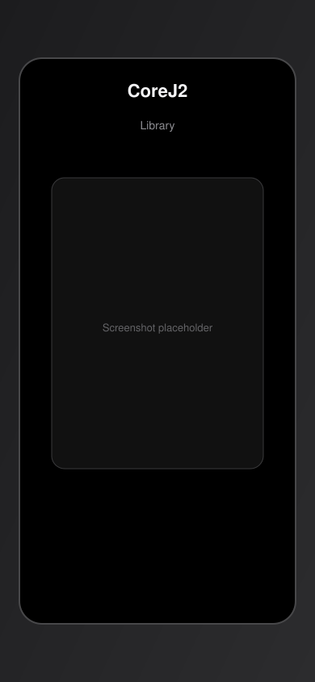
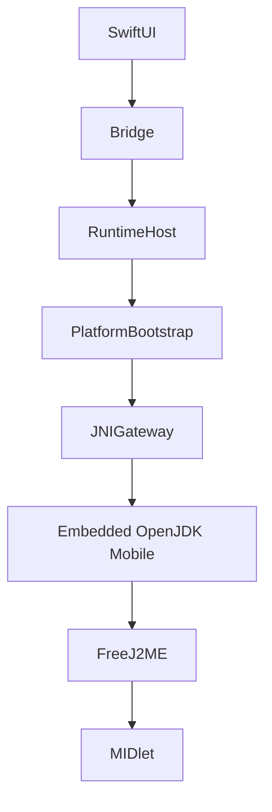

# JavaOne

Native **Java ME (J2ME)** emulator for iPhone and iPad.

JavaOne brings classic MIDlets to modern Apple devices with a first-party feel: SwiftUI library, sandboxed saves, virtual keypad, and an embedded FreeJ2ME runtime on OpenJDK Mobile.

{ width="280" }
{ width="280" }

## What you can do today

- Import `.jar` MIDlets into a local library
- Launch games through the Emulator Bridge
- Play with on-screen keypad and touch
- Persist MIDP RMS under the iOS Documents sandbox

## Start here

| Guide | Purpose |
|-------|---------|
| [Getting Started](getting-started.md) | Run your first MIDlet |
| [Compatibility](compatibility.md) | Device-validated titles |
| [Architecture](architecture.md) | How the stack fits together |
| [Building](building.md) | Build from source |
| [Roadmap](roadmap.md) | Epics and next milestones |
| [FAQ](faq.md) | Common questions |
| [Technical Reports](technical-reports.md) | Engineering deep dives |

## Runtime stack

## Project links

- [Changelog](https://github.com/javaonelabs/JavaOne/blob/main/CHANGELOG.md)
- [Contributing](https://github.com/javaonelabs/JavaOne/blob/main/CONTRIBUTING.md)
- [Security](https://github.com/javaonelabs/JavaOne/blob/main/SECURITY.md)
- [Code of Conduct](https://github.com/javaonelabs/JavaOne/blob/main/CODE_OF_CONDUCT.md)
