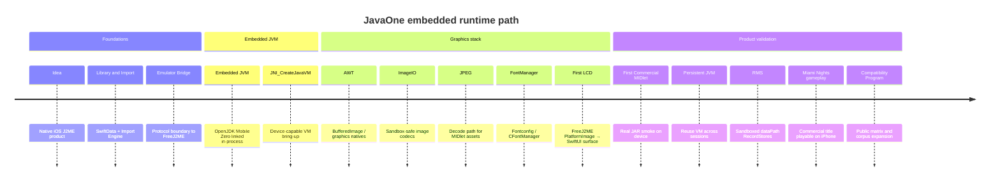

# Technical Milestones

Engineering timeline from idea to device-validated MIDlets.

## Narrative

| Milestone | Meaning |
|-----------|---------|
| Idea | Ship J2ME on iPhone with first-party UX |
| Embedded JVM | In-process OpenJDK Mobile instead of external process |
| `JNI_CreateJavaVM` | Correct `java.home` / boot path on device |
| AWT | Enough desktop graphics natives for FreeJ2ME buffers |
| ImageIO / JPEG | Asset decode without desktop filesystem assumptions |
| FontManager | Text rendering dependencies for LCD |
| First LCD | Pixels from FreeJ2ME into EmulatorView |
| First commercial MIDlet | Unmodified JARs beyond hello-world |
| Persistent JVM | Launch/stop cycles without destroying the VM every time |
| RMS | Writable RecordStore paths under Documents |
| Miami Nights gameplay | Commercial title: launch, menus, gameplay, save/load on device |
| Compatibility Program | Public, data-driven title matrix |

See also: [Architecture](architecture.md) · [Roadmap](roadmap.md) · [Technical Reports](technical-reports.md)
